# Transaction Management System

A web service built with Spring Boot + EasyUI that provides transaction management capabilities.

## Overview

This project implements a transaction management system that allows users to create, modify, delete, list, and pagination query transactions through RESTful APIs or Web page.

## Features

- Add new transactions
- Modify existing transactions
- Delete transactions
- Query transactions by conditions or pagination
- Error handling for duplicate transactions , non-existent transactions, Parameter verification, Custom Annotations verification

## Technologies

- Java
- Spring Boot
- Spring Web
- RESTful APIs
- Easy UI

## API Endpoints

### Transaction Management

| Method | Endpoint | Description |
|--------|----------|-------------|
| POST | `/transaction` | Add a new transaction |
| PUT | `/transaction/{orderNo}` | Modify an existing transaction |
| DELETE | `/transaction/{orderNo}` | Delete a transaction |
| GET | `/transaction/list` | query transactions by conditions or pagination |
| GET | `/transaction/revise/record` | query revised transactions record|

## API Response Codes

| Status Code | Description | Example |
|-------------|-------------|-------------|
| 200 | Success | /
| 400 | Bad Request - Invalid input parameters | amount must be greater than 0.01
| 500 | Internal Server Error/ Bussiness Logic Error |Duplicate transaction

## Getting Started

### Prerequisites

- Java JDK 21
- Maven
- Your favorite IDE (IntelliJ IDEA, Eclipse, etc.)

### Start

1. Clone the repository
2. Use IntelliJ IDEA open this project as a maven project
3. Start the project

### How to use

#### 1. Use Swagger UI to test API

http://localhost:8080/swagger-ui/index.html

#### 1.1 Add a new transaction
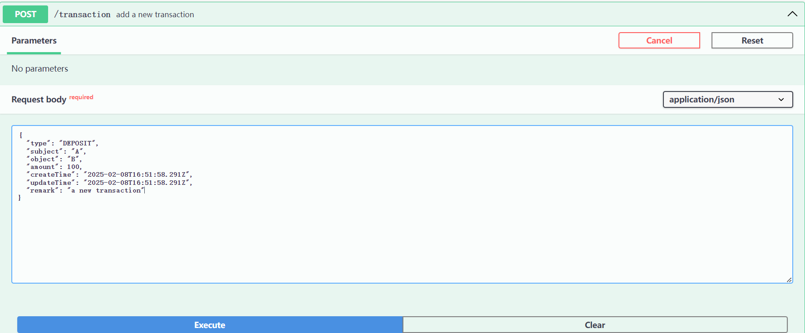
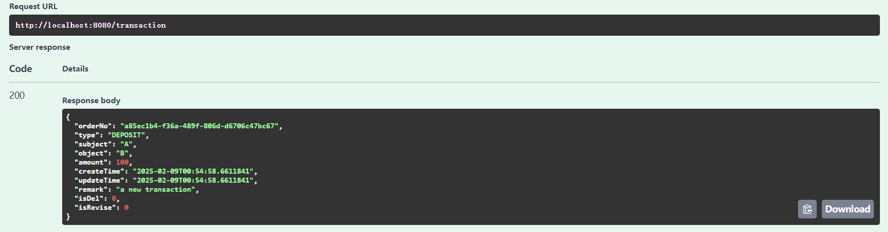
#### 1.2 Add a invalid parameter transaction
##### 1.2.1 transaction subject is not blank
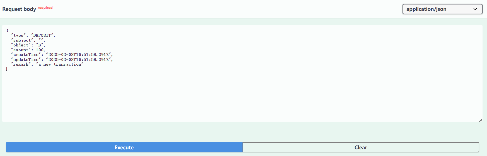
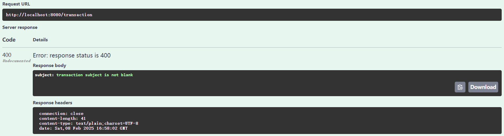
##### 1.2.2 Invalid transaction type enum value
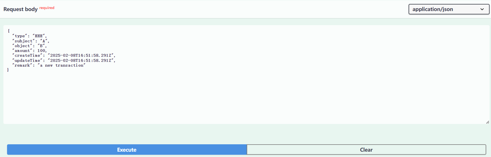
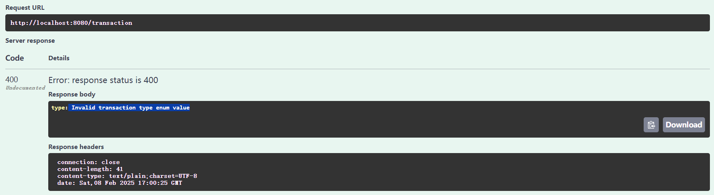
##### 1.2.3 amount must be greater than 0.01
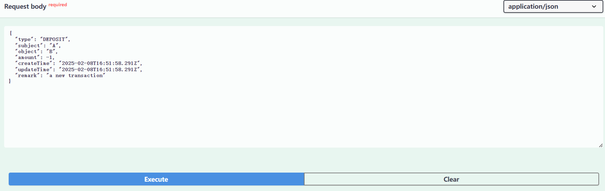
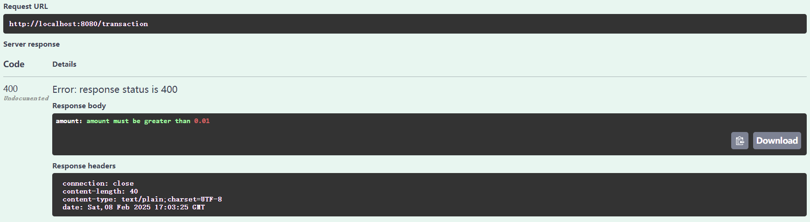
#### 1.3 Add a duplicate transaction
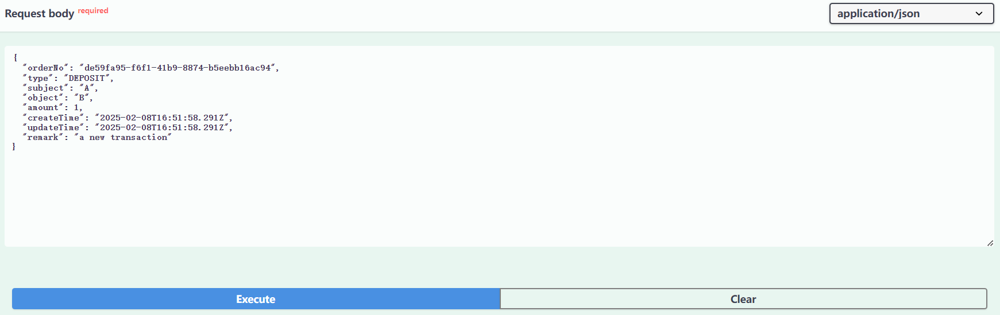

#### 1.4 Modify a transaction
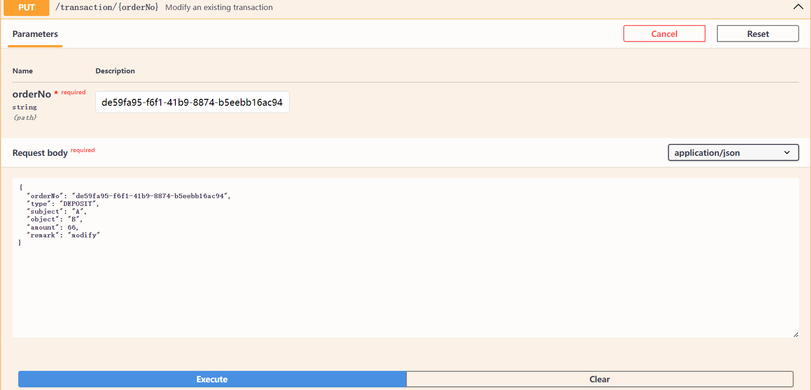
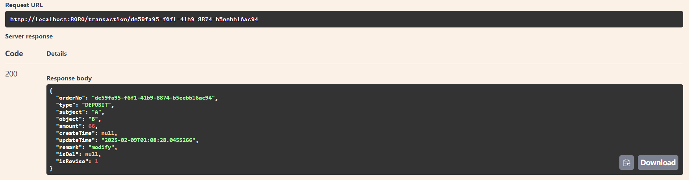
#### 1.5 Modify a non-exist transaction
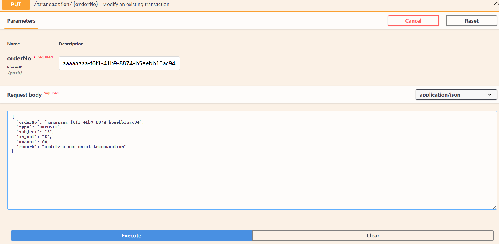
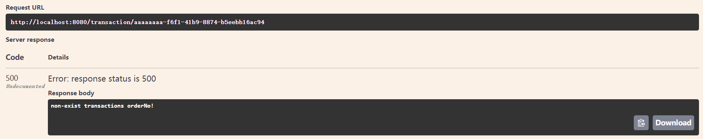
#### 1.6 Delete a transaction
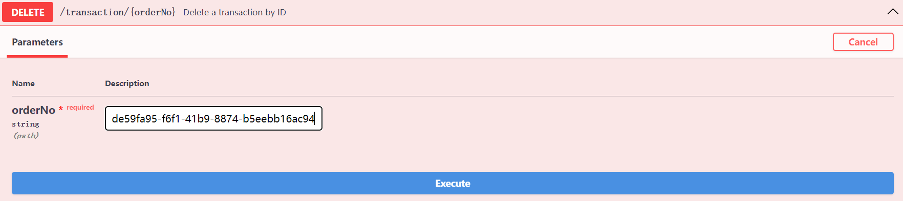
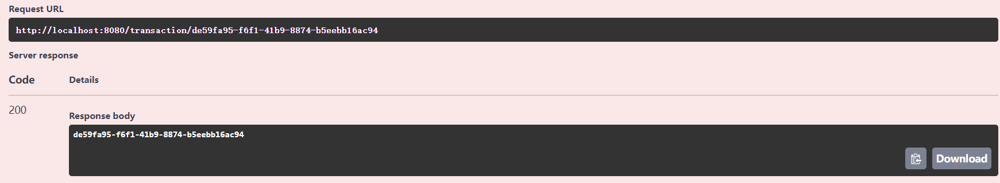
#### 1.7 Query not deleted transaction by pagination
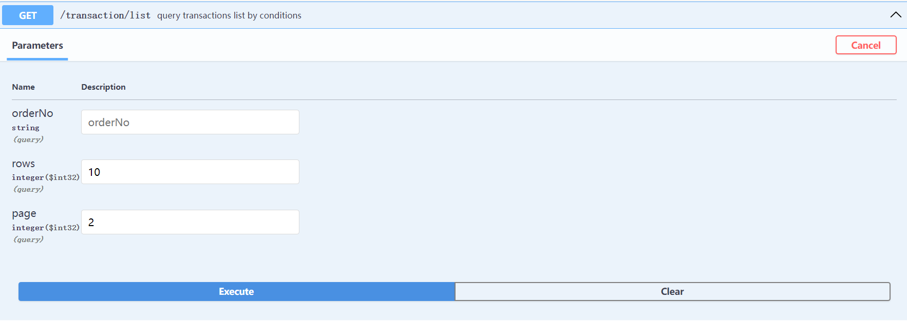
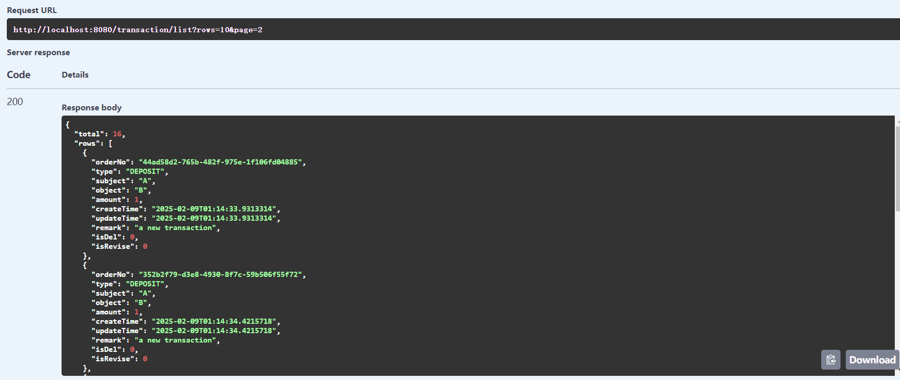
#### 1.8 Query revise transaction records
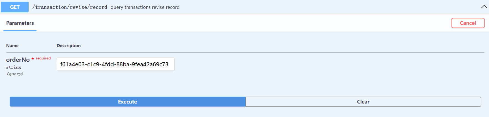
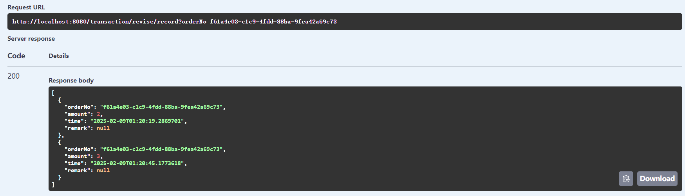

#### 2. Use Web Page

http://localhost:8080/index.html

#### 2.1 Add a transaction
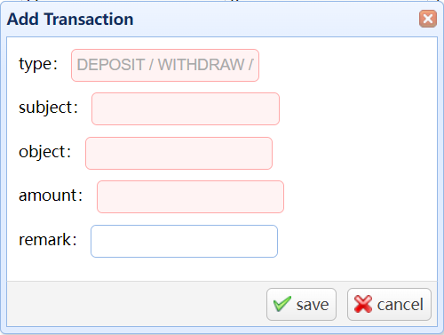
#### 2.2 Edit a transaction
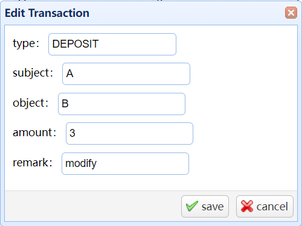
#### 2.3 Delete a transaction
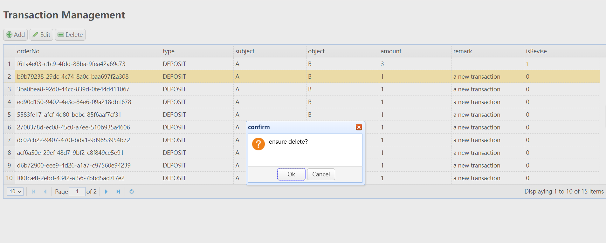
#### 2.4 Query not deleted transaction by pagination

#### 2.5 Invalid parameter
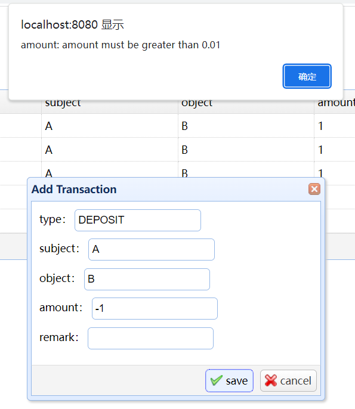

### Testing
#### TransactionControllerTest.class
This test suite validates the functionality of the Transaction Management API endpoints using Spring Boot's testing framework.All tests passed.

#### Performance Test
This load test suite evaluates the performance and reliability of the Transaction Management API under concurrent load conditions using Spring Boot's testing framework.
##### Test Configuration
- **Test Environment**: Windows x64 4C 16G
- **Client**: Jmeter 5.6.3
- **Concurrency**: Multi-threaded execution
##### Load Test Parameters
- Number of Threads: 10000
- Requests per Thread: 1
- Total Requests: 10000
- Timeout: 1 minutes
- Success Rate Threshold: 100%
##### Test Scenario: Transaction Creation
The test creates multiple transactions concurrently with the following characteristics:
- Fixed type (DEPOSIT)
- Fixed subject (TEST-A)
- Fixed object (TEST-B)
- Fixed amount (1)
- Fixed remark (TEST add a new transaction)
  
- Concurrent POST requests to `/transaction`
##### Sample Output
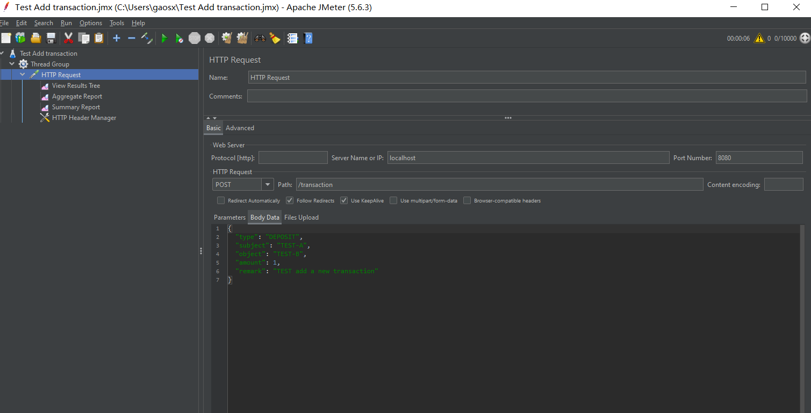
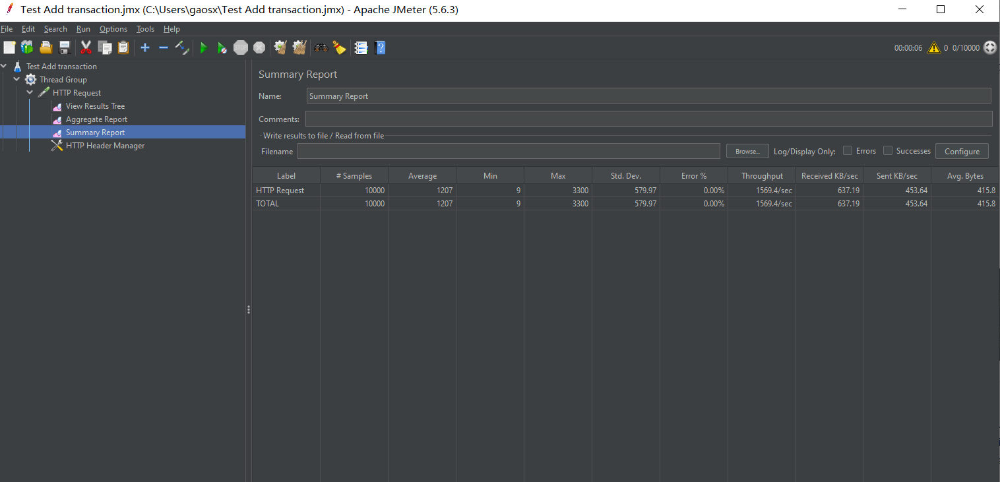
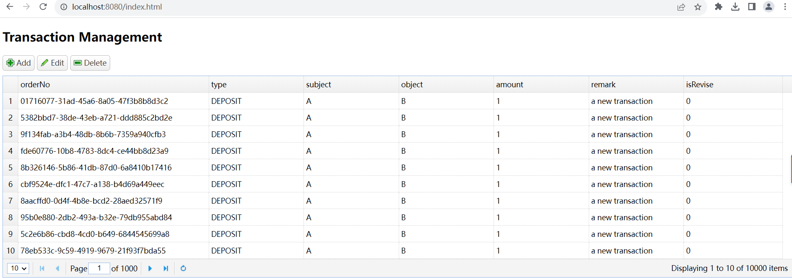

### External Libraires outside the standard JDK
##### 1. org.projectlombok.lombok
Used to generate getter and setter methods for the Transaction class.
##### 2. org.springframework.boot.spring-boot-starter-validation
Used to validate the input parameters of the Transaction Management API endpoints.
##### 3. org.apache.maven.plugins.maven-assembly-plugin
Used to package the progject
#### 4. org.springdoc.springdoc-openapi-starter-webmvc-ui
Used to surpport springdoc-openaip.So we can view and test APIs on browser
#### 5. org.springframework.boot.spring-boot-starter-test
Used to support testing

#### 1.  Dockerfile
We can use a Dockerfile to create a Docker image and upload the image to Docker Hub.